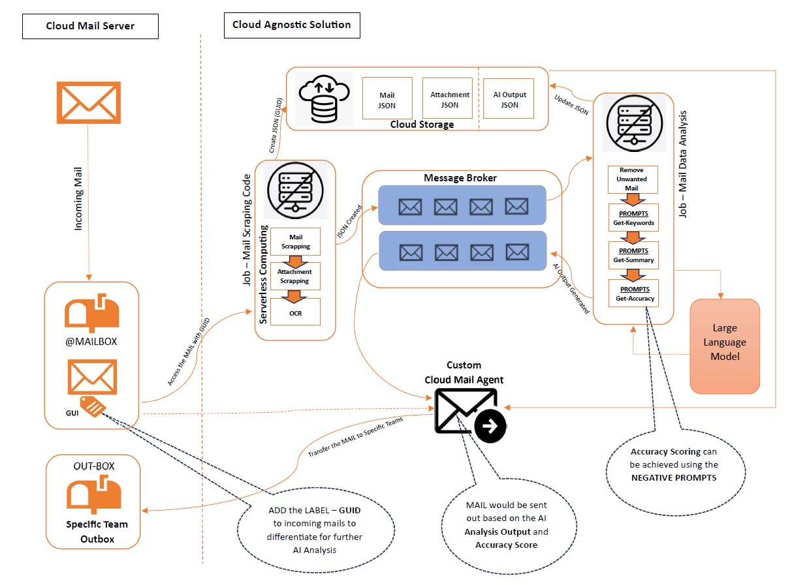

# 🚀 Project Name

## 📌 Table of Contents
- [Introduction](#introduction)
- [Demo](#demo)
- [Documentation](#documentation)
- [How to Run](#how-to-run)

---

## 🎯 Introduction
Our solution streamlines email triage for Commercial Loan Servicing by automatically classifying incoming requests and extracting key data using Generative AI and OCR. It reads raw email files, interprets the content and attachments, and outputs structured information including request type(s) (with sub-types, confidence scores, and reasoning), extracted fields (e.g. loan IDs, amounts, dates), and duplicate detection flags. Crucially, the system learns from each batch of emails – it dynamically updates its catalog of request types and regenerates a high-level functional grouping after each run. This means as new request themes emerge, the AI adaptively re-organizes them under evolving categories, ensuring the classification stays robust over time. Key features of our pipeline include:

-	Email parsing and analysis of both the email body and attachments.
-	Intelligent attachment processing for images (OCR), PDFs, and Word documents.
-	Duplicate request detection to flag repeat inquiries with reasoning.
-	Request type classification with confidence scoring and reasoning for explainability.
-	Dynamic category updates so new request types are learned and reused over time.
-	Functional grouping of request types into higher-level categories using the LLM (Gemini).
-	Evolving grouping across runs to adapt as more emails are processed.


## 🎥 Demo 
📹 [Working Video Demo of Code](artifacts/demo/Hackathon_Demo.mp4)

## 📄 Documentation
📄 [View The documentation to the solution here!](artifacts/demo/AI_Email_Classification_Documentation.docx)

## 🏃 How to Run
1. System Requirements
   - Ensure the following are installed on your system:
   - Python 3.8+
   - pip (Python package manager)
   - Tesseract OCR Engine
   - Internet connectivity (for Gemini API)

2. Install Required Python Packages
Open terminal (or PowerShell on Windows) and run:
```sh
pip install google-generativeai pytesseract pillow python-docx pdfplumber python-magic
```
3. Install Tesseract OCR (Required for Image Attachments)
Windows:
Download: https://github.com/tesseract-ocr/tesseract/wiki

After install, add Tesseract’s path to the system environment variables.

Example:
```sh
C:\Program Files\Tesseract-OCR\tesseract.exe
```
4. Set Up Your Gemini API Key
Windows:
```sh
set GOOGLE_API_KEY=your_key_here
```
Replace your_key_here with your actual Gemini API key.

5. Folder Structure
Ensure your project directory looks like this:
```sh
project_root/
│
├── downloadable_emails_mixed3/     # Folder containing .eml email files
│
├── hack_gemini_4.py                # Main script
│
├── gemini_analysis_history.json    # Will be created after 1st run, used to track history of emails
├── gemini_email_output.json        # Final merged output (Created after run)
├── request_type_categories.json    # Tracks all request types encountered (Created after run)
│
├── categorized_outputs_<timestamp>/         # Output folder per run (Created after each run)
├── functional_grouping_map_<timestamp>.json # Gemini-based functional classification (Created after each run)
├── functional_grouping_explanation_<timestamp>.json #Gemini-based functional classification explanation (Created after each run)
```
🖼️ Future Architecture Diagram:

